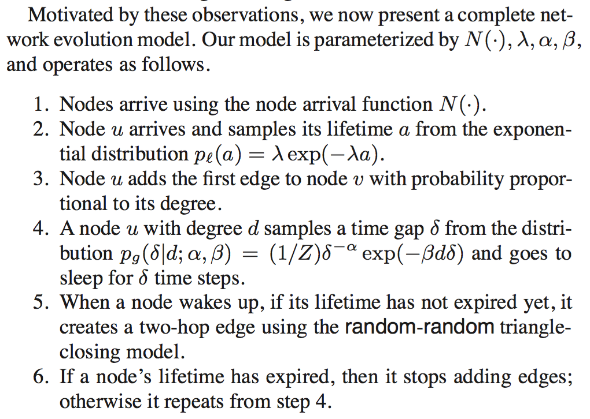

## Microscopic Evolution of Social Networks

### Overview
This paper analyzes the individual temporal information of nodes in 4 online social networks to develop a growth model based on local node behavior. It evaluates models using the likelihood of a given model to generate the observed data. Each model is decomposed into 3 local processes - node arrival (when do nodes arrive) process, edge initiation process (when do nodes initiate new edges) and edge destination selction process (which node does it connect to). These processes are combined in the final growth model.

### Analysis
* Data
    * All 4 networks (flickr, answers, delicious, linkedin) are directed. The node that initiates the edge is the source.
    * Significant percent of edges in these network **close** triangles (not the same as the number of triangles in the network)
* Evaluation
    * the networks are "unrolled" edge by edge using node arrival and edge creation data
    * for every edge, what is the probability of the edge endpoints to form an edge under the given model?
* Choosing edge source based on age and/or degree
    * **Edge attachment**: nodes in all 4 networks form edges preferentially; Edge attachment by degree is linear.
    * **Node age**: the level of activity (edge formation) is uniform over a node's lifetime. 
    * In each model, the probability of picking a node is proportional to its age and/or degree
    * The probability of an edge formation is the product of the probability of picking the edge source and edge destination
    * The performance/likelihood of a model depends on how much a network is biased towards degree and age
    * All models perform better on the edge source than on edge destination
    - this means that the choice of node to connect to is not well captured using degree and age
    * The simplest model (PA) is chosen 
* Choosing edge destination based on locality
    * nodes that are in the locality of the edge source are more likely to be selected as edge destinations (triadic closure, homophily)
        - degree-age models don't account for this and consequently don't perform well in selecting edge destination
    * **Edge attachment locality**: number of edges formed edges decays exponentially as hop distance increases
        - The number of edges increases exponentially as hop distance increases
        - So, the probability of linking to a node decreases double-exponentially as hop distance increases
    * **Triangle-closing models** that're strongly biased towards locality are considered
        * baseline: randomly link to a node at distance of 2 from the source
        * model: pick a neighbor v using a mechanism, pick neighbor of neighbor w using a mechanism, form link to w
        * mechanisms: random, degree, common friends, last activity, common friends + last activity
        * The simplest model (random-random) is chosen; performance gain over baseline is 10%
* Modeling arrival processes
    * **Node lifetime**: amount of time for which a node remains active and can form edges; exponential distribution used
    * **Time gap between edges**: power law with exponential cutoff used
        * separate distribution based on degree of node 
        * the exponential cutoff increases linearly as degree increases but power law exponent remains constant
        * this means that the gap between edge formation reduces as nodes get older 
    * **Node arrival**: vary and highly dependent on network, needs to estimated from observed network

### Growth model
- the final degree of a node increases exponentially as the age of a node increases
- combining temporal models of node lifetime and edge gap results in a power law degree distribution
    - predicted power law exponent is very close to the true power exponent
- the growth model generates graph with similar global properties (clustering, hop distance, power law)
    - outperforms PA model

### Conclusions
- growth models that incorporate local processes can generate graphs with similar macro properties
- likelihood approach can be used to evaluate the bias of a network towards local properties
- **strengths**
    + decomposes network into 3 distinct local processes
    + model provides intution behind edge formation in social networks
    + outperforms "global" growth model (PA) using locality bias in models
    + model is flexible, different mechanisms can be used to account for attributes
- **weaknesses**
    + only a few datasets have temporal information of all edges and nodes in the network
    + analysis is restricted to social networks that have temporal data; is bias towards locality equally strong in other networks?
    + no analysis of attributes
- **using attributes**
    - Does this model preserve assortativity? 
        - since social networks are assortative, edge formation based on locality somewhat accounts for homophily
    - A new node adds its first edge preferentially. Wouldn't perfomance improve if the first node to link to is sampled using similarity and degree?
        - sampling first edge using similarity may also improve assortativity since subsequent edges are dependent on the node's neighbors
    - Incorporating attributes will complicate model evaluation
        - nodes have multiple attributes and not all attributes are equally important 
        - different subsets of attributes can be used for edge formation
        - the probability of edge formation would depend on the attribute(s), attribute value(s) and local properties such as degree and age 
